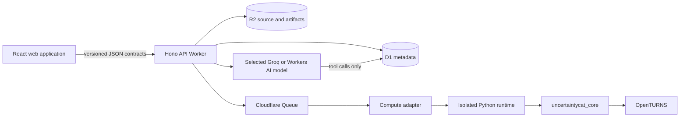
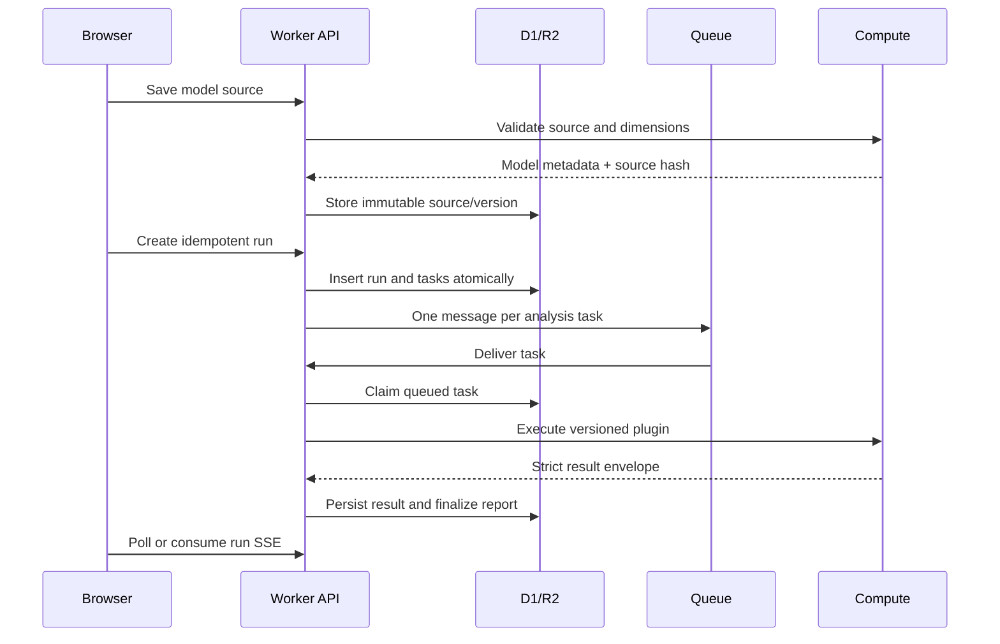

# Architecture

## Goals and boundaries

The new architecture separates scientific code, task orchestration, persistence, presentation, and AI
narrative. OpenTURNS remains numerical authority. The browser never imports Python result objects, and
the Worker never contains algorithm implementations. Authentication is resolved once at the Worker edge
before any `/api/v1/*` application resource is read or mutated; session discovery is the sole exception.

## Components

### `uncertaintycat_core`

The installable Python package is independent of Streamlit and HTTP. It provides:

- source preflight, compilation, shape validation, and immutable model metadata;
- strict Pydantic request/result contracts;
- an explicit catalog of versioned `AnalysisPlugin` implementations;
- deterministic orchestration and a common provenance envelope;
- shared sample caching inside one runtime for analyses with identical sample size and seed.

Plugin keys and versions are persisted with each task. Result schema versions are independent from
plugin implementation versions so a mathematical change and a transport change can be migrated
deliberately.

### `services/compute`

FastAPI exposes health, catalog, validation, single-analysis execution, and data-driven surrogate fitting. It accepts an optional
constant-time bearer-token check and converts domain errors to stable public error codes. The image runs
as a non-root user and supports read-only filesystems, dropped capabilities, memory/CPU limits, and a
private Docker network.

`services.compute.cli` implements the same protocol as a one-shot process. In production validation gets a
fresh disposable Sandbox; analysis tasks reuse a sandbox scoped only to their run to avoid repeated cold
starts. Every request uses a unique input file and a constant CLI command with a three-minute timeout. The
run finalizer/canceller destroys the run sandbox, while any transport failure destroys it immediately. The
Sandbox class disables public internet access. The local FastAPI service remains the fast development adapter.

### `apps/api`

The Hono application is compatible with Cloudflare Workers and owns:

- Better Auth sessions through Cloudflare OIDC and one authenticated API boundary;
- D1 persistence and ownership checks;
- immutable Python source storage in R2;
- idempotent run creation, daily task quotas, queue delivery, retry exhaustion, and partial completion;
- reports, JSON/CSV ZIP exports, share-link hashing/revocation/expiry, and persisted AI conversations;
- a single adapter boundary to the compute protocol.

Workers static assets and the API share the apex origin. `www` receives a permanent canonical redirect,
which keeps Better Auth cookies, CORS, and OAuth callbacks on one origin.

The Worker does not create anonymous owner IDs or guest cookies. Public requests can read health and
session policy only. Analysis metadata, example source, projects, datasets, models, runs, reports, exports,
shared reports, and AI endpoints all return HTTP 401 before their route logic when no authenticated session
is present. A share token grants report selection, not anonymous application access.

`/api/v1/operator/overview` adds a second authorization boundary inside the authenticated API. It resolves
operator status from a normalized exact-email allowlist, rechecks that claim in the Worker, and returns only
bounded operational metadata from D1. The projection includes aggregate state, account/project identifiers,
execution status and duration, analysis keys, and sanitized stored error summaries. It deliberately excludes
model source, model/result/config JSON, datasets, chat content, and R2 object keys. Global overview indexes are
forward-only migration state; the dashboard never writes application data.

Numerical results are stored as immutable task JSON. Report generation is a projection over those task
records, so a failed section does not destroy successful evidence.

### `apps/web`

React Router, TanStack Query, CodeMirror, and a lazy Apache ECharts adapter provide the product UI. The
public home route renders static explanatory method/model examples without calling protected analysis
APIs. Every other application route is wrapped by `AuthenticatedRoute`, independently enforcing the same
boundary as the Worker. Cloudflare authentication returns to the project dashboard. Reference examples and
editable Python are one authoring mode; the guided builder emits the same Python model contract using
OpenTURNS `SymbolicFunction`.

Configured operators receive one additional **Operations** navigation item. Its dashboard polls the private
snapshot every 30 seconds while open and also supports manual refresh and 24-hour, 7-day, or 30-day windows.
It is an application-state view, not a replacement for Cloudflare Workers Logs, Worker Metrics, D1 Metrics, or
queue observability.

Every scientific workspace is scoped beneath `/studies/:projectId`; global navigation exposes the project
index rather than duplicating dashboard, project, and new-analysis destinations. Within a project, six
deliberately distinct views share one contextual navigation surface:

- project overview and retained results;
- model authoring and direct analysis;
- OTMorris dimensionality screening;
- deterministic parameter calibration against named observations;
- validated PCE/GPR surrogate construction from a model or Gaussian-process regression from paired data; and
- empirical distribution fitting.

The direct run composer is catalog-driven but filters calibration, Morris, PCE, and GPR because those capabilities need
their own scientific sequence and controls. A promoted surrogate is passed back to direct analysis only by
an explicit Surrogate Studio handoff, which preserves evidence-source provenance without presenting
surrogation as an ordinary analysis checkbox. Reduced models and promoted surrogates can either start a new
analysis in their current project or be copied into a newly created project. Surrogate handoff copies both
the exact source model and the immutable OpenTURNS XML artifact after checking their source hashes.

Catalog applicability is a versioned, deterministic assessment covering every registered plugin. It combines
plugin-declared copula support with model-level dimension, marginal, output-variability, and bounded-resource
constraints. The Worker repeats the incompatibility decision at run creation, so a hand-written request cannot
bypass a greyed-out UI choice. The composer displays the exact first blocking reason after validation: classical
Sobol, FAST, Morris, and PCE require independent inputs, while ANCOVA is reserved for a dependent copula.
ANCOVA fits an independent-marginal polynomial
decomposition, validates it against the declared dependent distribution, and persists separate physical and
correlation-driven first-order variance contributions through the generic result envelope.

Each queued analysis task owns a persisted D1 progress record. The compute CLI writes bounded, source-free phase
events to stderr; Cloudflare Sandbox streams those events to the Worker while stdout remains the strict final JSON
envelope. The Worker records phase, percentage, indeterminate status, retry attempt, and timestamp, and the run page
renders a separate accessible progress bar per task. Plugins may publish real phase boundaries; opaque OpenTURNS
calls remain explicitly animated and indeterminate instead of displaying a fabricated percentage.

Target-domain HSIC remains a project-scoped direct analysis because it consumes the current model and one
explicit scalar critical domain. Its custom composer controls select the threshold direction, threshold,
and bounded permutation count; `uncertaintycat_core` alone samples the declared distribution, constructs
the OpenTURNS distance filter and kernels, validates empirical target coverage, and returns aggregate
indices. Target-HSIC execution adds no sampled input/output rows or Python source to the stored report,
browser bundle, logs, or report-chat prompt. The persisted `target_hsic` key and `1.0.0` result schema are separate from global `hsic`, so older
reports retain their original meaning. Plugin `1.1.0` adds source-free target-coverage, kernel,
observed-index, permutation, and ranking progress phases without changing the numerical result schema.

Calibration Studio retains the current project model and uses stable OpenTURNS `ParametricFunction`,
`NonLinearLeastSquaresCalibration`, and `CalibrationResult` APIs inside the same Sandbox boundary. Selected
continuous inputs become constant unknown parameters; all remaining inputs and the scalar output must be
supplied as exact named observation columns. The plugin caps parameter count, observation rows, optimizer
work, stored predictions, and model dimension; validates the residual Jacobian at the start and optimum; and
persists exact atomic model-evaluation accounting separately from optimizer calls. Its parameter distribution
is labelled as OpenTURNS' local linear Gaussian approximation with bootstrap disabled, never as an exact
confidence guarantee. A successful fit is explicitly not evidence of global identifiability, causality, or
validity outside the observed domain.

Model validation records a versioned workflow recommendation. Assessment version `1.3.0` adds deterministic
target-HSIC eligibility for at most twenty continuous inputs while retaining the requirement for a
user-defined critical domain. Its validation outcome, deterministic facts,
AI brief, and recommended route are rendered together so an assessment does not fragment across the
authoring page. The deterministic rule prioritizes Morris at
15 or more inputs, recommends an eligible surrogate above a measured five-second projection per 1,000
evaluations, and otherwise recommends direct analysis. The selected AI provider explains validated metadata
separately; it does not choose the route. The isolated validator produces
bounded equation metadata for every Python model: closed-form LaTeX for reducible callbacks and symbolic
formulas, or an exact formal `y=f(x)` mapping for procedural solvers and control flow. Authors may explicitly
declare bounded governing LaTeX for procedural models. Curated reference equations take precedence. While
that deterministic definition renders immediately, the authenticated Model Understanding request sends at
most 32,000 model-source characters to the selected AI provider for a clearly labelled approximate LaTeX
interpretation. It is explanatory rather than numerical evidence and falls back to the deterministic mapping.
The deterministic workflow recommendation is gated on that same completed state, so it cannot appear ahead of
Model Understanding. A forward-only D1 `equations_json` cache backfills existing immutable model versions
without rewriting their historical `metadata_json` or R2 source.

Routes are split so the Python editor is loaded only in the model workspace. Reports are responsive HTML,
lazy-load the plotting runtime, retain exact table/text fallbacks, and lazy-load `html2canvas`/`jsPDF` only
when the user requests a direct PDF download; machine-readable evidence is a separate ZIP.

### `packages/contracts`

Zod input schemas and TypeScript result types are shared by browser and Worker. Python remains the source
of truth for analysis config/result contracts; CI typechecks both sides and integration tests exercise the
HTTP serialization boundary. A future generator can derive the TypeScript catalog types from the
compute OpenAPI document without changing clients.

## Run lifecycle

Task claiming is conditional on `status = 'queued'`, making redelivery safe. Retryable transport failures
return a task to the queue; exhausted retries create a terminal failure and allow the run/report to
finalize. Run cancellation prevents queued tasks from executing and records a terminal state.

## Report conversation harness

The report assistant uses the open-source Vercel AI SDK (`streamText`, bounded multi-step tools, and Zod
tool inputs). `apps/api/src/ai-provider.ts` is the single deployment-selectable adapter. The default Groq
path uses Groq's official Vercel provider and OpenAI-compatible API; the retained Cloudflare path uses the
pinned open-source `workers-ai-provider`. `AI_PROVIDER=groq|cloudflare` selects one path at deployment, and
the public session policy reports the active non-secret model labels so the UI never mislabels a response.

The model receives conversation history and can read only these projections of persisted numerical data:

- section/status/available-field outline;
- scalar metrics, facts, assumptions, and warnings;
- a bounded page from a named table;
- a bounded page from a named series;
- a bounded row/column window from a named matrix.

It cannot read model source, call compute, run code, write D1, or mutate a report. The chat contract receives
the persisted section names and completion states up front, requires the actual stored value to lead an
answer, and treats internal field names as discovery metadata rather than user-facing prose. Exact evidence
paths are rendered as compact, readable source badges while retaining the underlying path for inspection.
Previously stored snake-case evidence labels are humanized at render time without mutating the retained
conversation or changing inline code.
The contract also prevents an EDA correlation screen from being presented as a global sensitivity ranking,
prevents ANCOVA correlation contributions from being presented as causal or total-order effects, and
requires all completed sensitivity sections to be inspected before declaring findings absent.
Model Understanding receives bounded model source plus compact validated metadata, has a 240-to-360-word response contract and a bounded
output budget, and D1 caches it by model hash, prompt version, provider, and model ID. Groq defaults to
`openai/gpt-oss-20b` for the short brief, with one bounded `openai/gpt-oss-120b` fallback, and uses
`openai/gpt-oss-120b` for report chat. Low reasoning effort avoids unnecessary latency and parallel tool calls
are disabled because the report tools are intentionally serial and bounded. The Cloudflare option retains
Llama 3.2 3B/1B for Model Understanding and GLM-4.7-Flash for report chat. Model Understanding has 12- and
15-second attempt deadlines, zero automatic SDK retries, and a 30-second single-flight lease; concurrent clients poll the one active generation. Only successful
manual regenerations and successful report-chat answers enter the usage ledger. Chat messages and daily usage are
persisted in D1, so an authenticated user can resume a report conversation on another device. Structured Worker
logs record model ID, fallback use, outcome, duration, and output size without recording model source, prompts, or
numerical artifacts.

## Data ownership and retention

- D1 holds authenticated identities, projects, model assessment/lineage, bounded derived-equation caches,
  dataset and surrogate indexes, task state, report references, chat/understanding text, quotas, and
  share-link hashes.
- R2 holds immutable model source, private original datasets, promoted model-based surrogate XML, and
  retained data-driven Gaussian-process XML. Raw share tokens are never persisted.
- A report bundle contains its manifest, complete JSON, and normalized CSV views so it remains useful
  outside UncertaintyCat.
- Authenticated project deletion requires exact-name confirmation in the UI, removes the owner-scoped D1
  project graph, cancels its active compute sandboxes, and deletes referenced R2 objects. Account-level quota
  history remains intact so deleting a project cannot reset daily usage.

## Extension strategy

New OpenTURNS functionality enters through a plugin, scientific tests, and catalog metadata. UI routes,
queue orchestration, exports, reports, and chat tools consume the common envelope and normally require no
changes. See [ANALYSIS_PLUGIN_GUIDE.md](ANALYSIS_PLUGIN_GUIDE.md).
