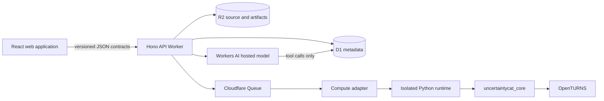
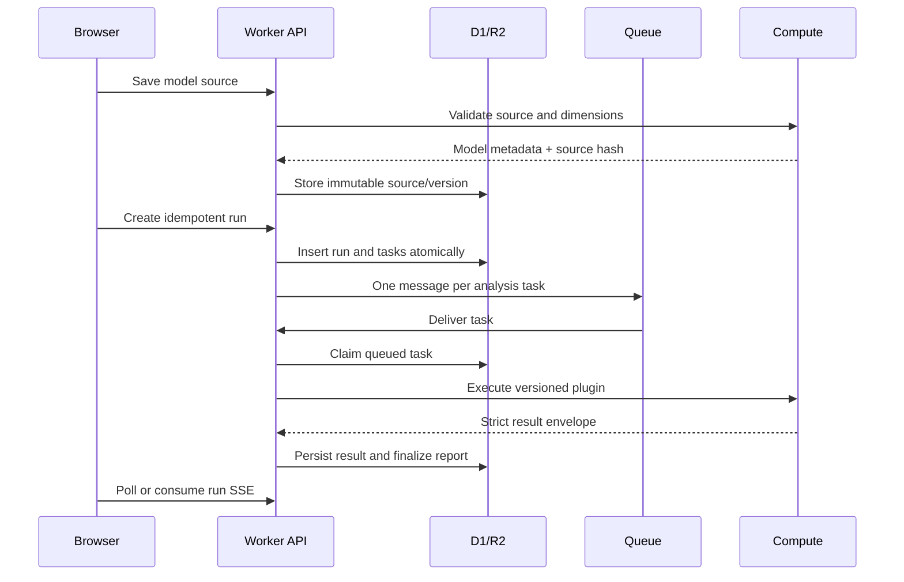

# Architecture

## Goals and boundaries

The new architecture separates scientific code, task orchestration, persistence, presentation, and AI
narrative. OpenTURNS remains numerical authority. The browser never imports Python result objects, and
the Worker never contains algorithm implementations. Authentication is resolved once at the Worker edge
before any `/api/v1/*` application resource is read or mutated; session discovery is the sole exception.

## Components

### `uncertaintycat_core`

The installable Python package is independent of Streamlit and HTTP. It provides:

- source preflight, compilation, shape validation, and immutable model metadata;
- strict Pydantic request/result contracts;
- an explicit catalog of versioned `AnalysisPlugin` implementations;
- deterministic orchestration and a common provenance envelope;
- shared sample caching inside one runtime for analyses with identical sample size and seed.

Plugin keys and versions are persisted with each task. Result schema versions are independent from
plugin implementation versions so a mathematical change and a transport change can be migrated
deliberately.

### `services/compute`

FastAPI exposes only health, catalog, validation, and single-analysis execution. It accepts an optional
constant-time bearer-token check and converts domain errors to stable public error codes. The image runs
as a non-root user and supports read-only filesystems, dropped capabilities, memory/CPU limits, and a
private Docker network.

`services.compute.cli` implements the same protocol as a one-shot process. In production validation gets a
fresh disposable Sandbox; analysis tasks reuse a sandbox scoped only to their run to avoid repeated cold
starts. Every request uses a unique input file and a constant CLI command with a three-minute timeout. The
run finalizer/canceller destroys the run sandbox, while any transport failure destroys it immediately. The
Sandbox class disables public internet access. The local FastAPI service remains the fast development adapter.

### `apps/api`

The Hono application is compatible with Cloudflare Workers and owns:

- Better Auth sessions through Cloudflare OIDC and one authenticated API boundary;
- D1 persistence and ownership checks;
- immutable Python source storage in R2;
- idempotent run creation, daily task quotas, queue delivery, retry exhaustion, and partial completion;
- reports, JSON/CSV ZIP exports, share-link hashing/revocation/expiry, and persisted AI conversations;
- a single adapter boundary to the compute protocol.

Workers static assets and the API share the apex origin. `www` receives a permanent canonical redirect,
which keeps Better Auth cookies, CORS, and OAuth callbacks on one origin.

The Worker does not create anonymous owner IDs or guest cookies. Public requests can read health and
session policy only. Analysis metadata, example source, projects, datasets, models, runs, reports, exports,
shared reports, and AI endpoints all return HTTP 401 before their route logic when no authenticated session
is present. A share token grants report selection, not anonymous application access.

Numerical results are stored as immutable task JSON. Report generation is a projection over those task
records, so a failed section does not destroy successful evidence.

### `apps/web`

React Router, TanStack Query, CodeMirror, and a lazy Apache ECharts adapter provide the product UI. The
public home route renders static explanatory method/model examples without calling protected analysis
APIs. Every other application route is wrapped by `AuthenticatedRoute`, independently enforcing the same
boundary as the Worker. Cloudflare authentication returns to the project dashboard. Reference examples and
editable Python are one authoring mode; the guided builder emits the same Python model contract using
OpenTURNS `SymbolicFunction`.

The application has four deliberately distinct scientific workspaces:

- model authoring and direct analysis;
- OTMorris dimensionality screening;
- validated PCE/GPR surrogate construction; and
- empirical distribution fitting.

The direct run composer is catalog-driven but filters Morris, PCE, and GPR because those capabilities need
their own scientific sequence and controls. A promoted surrogate is passed back to direct analysis only by
an explicit Surrogate Studio link, which preserves evidence-source provenance without presenting
surrogation as an ordinary analysis checkbox.

Model validation records a versioned workflow recommendation. The deterministic rule prioritizes Morris at
15 or more inputs, recommends an eligible surrogate above a measured five-second projection per 1,000
evaluations, and otherwise recommends direct analysis. Workers AI explains validated metadata separately;
it does not choose the route and does not receive Python source.

Routes are split so the Python editor is loaded only in the model workspace. Reports are responsive HTML,
lazy-load the plotting runtime, retain exact table/text fallbacks, and print cleanly to PDF; machine-readable evidence is a separate ZIP.

### `packages/contracts`

Zod input schemas and TypeScript result types are shared by browser and Worker. Python remains the source
of truth for analysis config/result contracts; CI typechecks both sides and integration tests exercise the
HTTP serialization boundary. A future generator can derive the TypeScript catalog types from the
compute OpenAPI document without changing clients.

## Run lifecycle

Task claiming is conditional on `status = 'queued'`, making redelivery safe. Retryable transport failures
return a task to the queue; exhausted retries create a terminal failure and allow the run/report to
finalize. Run cancellation prevents queued tasks from executing and records a terminal state.

## Report conversation harness

The report assistant uses the open-source Vercel AI SDK (`streamText`, bounded multi-step tools, and Zod
tool inputs) with Cloudflare's open-source `workers-ai-provider`. The selected provider version is pinned to
its Workers-AI-only release line so no external model provider is bundled. The configured model is
`@cf/zai-org/glm-4.7-flash`.

The model receives conversation history and can read only these projections of persisted numerical data:

- section/status/available-field outline;
- scalar metrics, facts, assumptions, and warnings;
- a bounded page from a named table;
- a bounded page from a named series;
- a bounded row/column window from a named matrix.

It cannot read model source, call compute, run code, write D1, or mutate a report. Model Understanding is
also source-isolated: it receives compact validated metadata, has a 300-word response contract and a bounded
output budget, and streams its response while D1 caches it by model hash and prompt version. Chat messages and daily
usage are persisted in D1, so an authenticated user can resume a report conversation on another device.

## Data ownership and retention

- D1 holds authenticated identities, projects, model assessment/lineage, dataset and surrogate indexes, task state, report references, chat/understanding text, quotas, and share-link hashes.
- R2 holds immutable model source, private original datasets, and promoted OpenTURNS surrogate XML. Raw share tokens are never persisted.
- A report bundle contains its manifest, complete JSON, and normalized CSV views so it remains useful
  outside UncertaintyCat.
- Deletion and retention endpoints are not yet implemented; they are a production launch gate.

## Extension strategy

New OpenTURNS functionality enters through a plugin, scientific tests, and catalog metadata. UI routes,
queue orchestration, exports, reports, and chat tools consume the common envelope and normally require no
changes. See [ANALYSIS_PLUGIN_GUIDE.md](ANALYSIS_PLUGIN_GUIDE.md).
